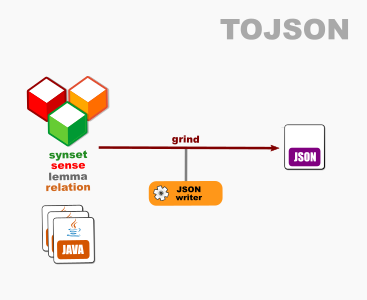

  

  

# OEWN model-to-JSON

This writes a model to JSON format.

Project [tojson](https://github.com/oewntk/tojson)

## Dataflow

## Maven Central

		<groupId>io.github.oewntk</groupId>
		<artifactId>tojson</artifactId>
		<version>3.0.1</version>
